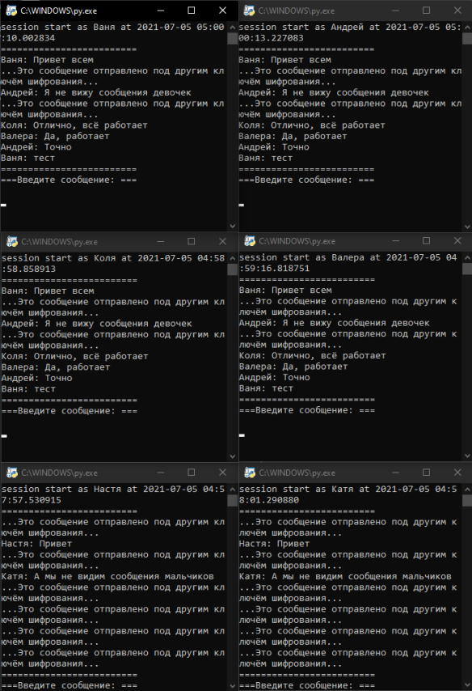

## Multi User chat with privat_key protection (AES).

1 step: Create key (file Create_Key_File.py)

2 step: run server (file Main_file.py)

3 step: run client (Client_ffile.py)

4+ step: run other client files for more users

### example:

